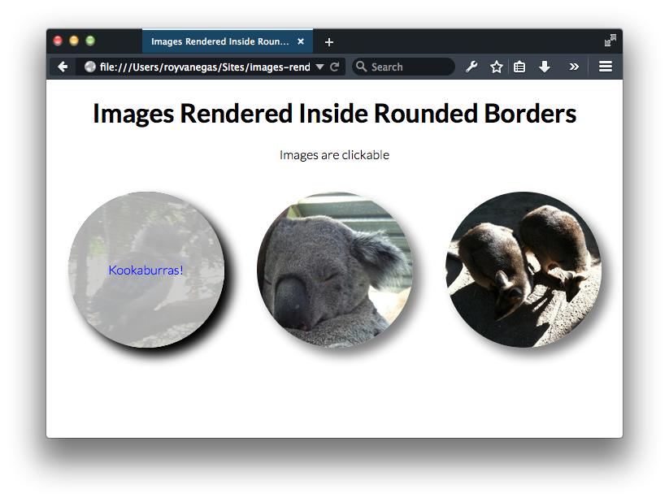

# Rendering Images Inside Circles Using CSS

This is a small project that shows how to render images inside circles using CSS via Sass. It also shows how to achieve this using the latter as a programming language.

There is no CSS file inside the `css` folder. You’ll need to compile the Sass file via the command line from inside this project’s root folder, as follows:

    sass --unix-newlines --sourcemap=none --style expanded --watch sass/style.scss:css/style.css

— Roy Vanegas
